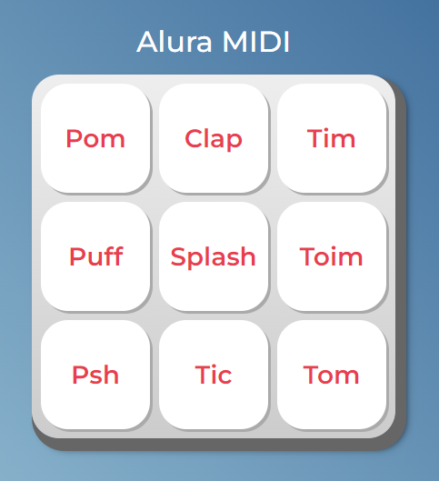

<h1 align="center"> Alura MIDI </h1>

Curso de JavaScript para Web: Crie páginas dinâmicas

  <a href="#-tecnologias">Tecnologias</a>&nbsp;&nbsp;&nbsp;|&nbsp;&nbsp;&nbsp;
  <a href="#-projeto">Projeto</a>

 

  

 

---

 

## 💻 Tecnologias

Esse projeto foi desenvolvido com as seguintes tecnologias:

- HTML e CSS
- JavaScript

 

## 📚 Projeto

Utilizando HTML e CSS para a criação de elementos gráficos, junto com o JavaScript para a manipulação dos componentes da página, permitindo modificação e interação, o **Alura MIDI** é uma aplicação focada na reprodução de samples semelhante a um Launchpad.
 
